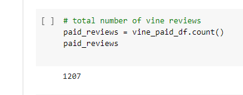
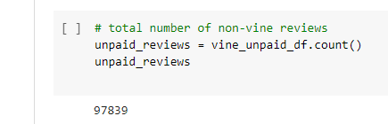
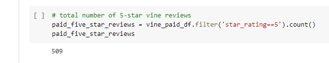
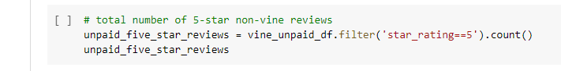
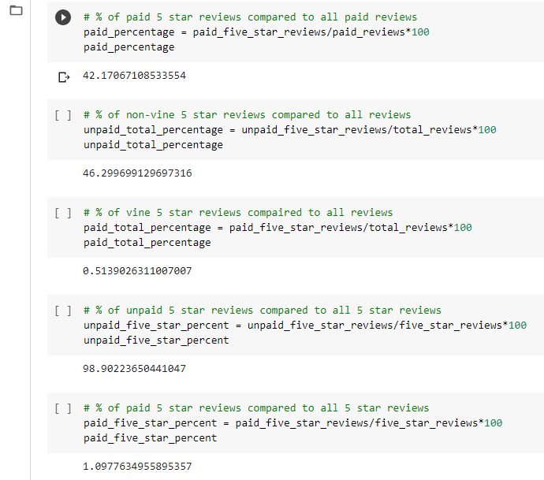

# Amazon Vine Analysis

## Overview:
- The purpose of this analysis was to evaluate if there is any bias toward favorable reviews from members of the Amazon Vine progam with in a selected dataset.

## Results:
- There were 1207 Vine reviews and 97839 non-Vine reviews

- 509 Vine reviews were 5-stars

- 45858 non-Vine reviews were 5-stars

- 42.17% of the Vine reviews were 5-star reviews
- 46.3 of the non-Vine reviews were 5-star reviews

## Summary
When looking at the percentage of 5-star reviews there does not appear to be much bias either way. The percentages are within about 4% of each other. To help support this, it would be a good idea to look at the break down of the other star reviews and see if there is any bias on the lower end.
